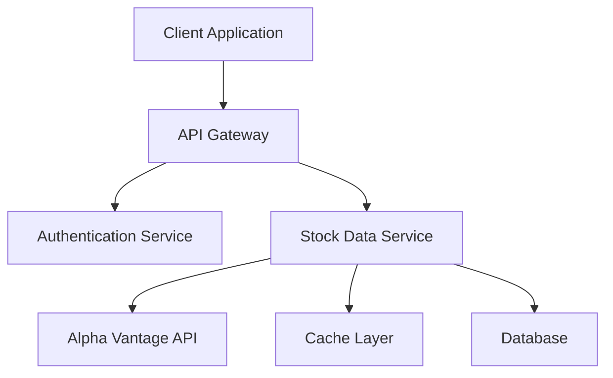

# Financial Dashboard Development Guidelines

## Table of Contents
1. [Introduction](#introduction)
2. [Architecture Overview](#architecture-overview)
3. [Development Standards](#development-standards)
4. [Quality Assurance](#quality-assurance)
5. [Security & Compliance](#security--compliance)
6. [Performance Guidelines](#performance-guidelines)
7. [DevOps Practices](#devops-practices)
8. [Monitoring & Maintenance](#monitoring--maintenance)

## Introduction

### Purpose
This document provides comprehensive development guidelines for our Financial Dashboard system, ensuring high-quality, maintainable, and secure financial software development.

### Core Principles
- **Reliability**: Ensure consistent and accurate financial calculations
- **Security**: Protect sensitive financial data
- **Performance**: Optimize for real-time financial data processing
- **Maintainability**: Write clear, documented, and testable code
- **Scalability**: Design for growing data volumes and user base
- **Compliance**: Adhere to financial industry standards

## Architecture Overview

### System Architecture

### Key Components
1. **Frontend (React + Material-UI)**
   - Single Page Application
   - Responsive design
   - Real-time data updates
   - Client-side caching

2. **Backend Services**
   - RESTful API endpoints
   - Rate limiting
   - Data validation
   - Error handling

3. **External Integrations**
   - Alpha Vantage API
   - Market data providers
   - Authentication services

## Development Standards

### Code Style

#### JavaScript/React Guidelines
\`\`\`javascript
// Component Example
const StockMetric = ({ label, value, tooltip }) => {
  return (
    <Tooltip title={tooltip}>
      <Box display="flex" justifyContent="space-between">
        <Typography variant="subtitle2">{label}</Typography>
        <Typography variant="body1">{value}</Typography>
      </Box>
    </Tooltip>
  );
};
\`\`\`

#### Naming Conventions
- **Components**: PascalCase (e.g., \`StockDashboard\`, \`MetricsCard\`)
- **Functions**: camelCase (e.g., \`calculateMetrics\`, \`fetchStockData\`)
- **Constants**: UPPER_SNAKE_CASE (e.g., \`API_ENDPOINT\`, \`MAX_RETRY_ATTEMPTS\`)
- **Files**: kebab-case (e.g., \`stock-metrics.js\`, \`api-client.js\`)

#### Code Organization
\`\`\`
financial-dashboard/
├── src/
│   ├── components/          # Reusable UI components
│   ├── services/           # API and data services
│   ├── hooks/             # Custom React hooks
│   ├── utils/             # Helper functions
│   └── constants/         # Configuration and constants
├── tests/                 # Test files
└── docs/                  # Documentation
\`\`\`

### Documentation

#### Component Documentation
\`\`\`javascript
/**
 * @component StockMetrics
 * @description Displays key financial metrics for a stock
 *
 * @param {Object} props
 * @param {string} props.symbol - Stock ticker symbol
 * @param {Object} props.metrics - Financial metrics object
 * @param {function} props.onRefresh - Callback for data refresh
 *
 * @example
 * <StockMetrics
 *   symbol="AAPL"
 *   metrics={metricsData}
 *   onRefresh={handleRefresh}
 * />
 */
\`\`\`

#### API Documentation
\`\`\`javascript
/**
 * Fetches stock financial data from Alpha Vantage
 * 
 * @async
 * @function fetchStockData
 * @param {string} symbol - Stock ticker symbol
 * @returns {Promise<Object>} Financial data object
 * @throws {ApiError} When API request fails
 * 
 * @example
 * try {
 *   const data = await fetchStockData('AAPL');
 * } catch (error) {
 *   console.error('Failed to fetch stock data:', error);
 * }
 */
\`\`\`

## Quality Assurance

### Testing Strategy

#### Unit Tests
\`\`\`javascript
describe('StockMetrics Component', () => {
  it('should display loading state while fetching data', () => {
    // Test implementation
  });

  it('should handle API errors gracefully', () => {
    // Test implementation
  });

  it('should format financial numbers correctly', () => {
    // Test implementation
  });
});
\`\`\`

#### Integration Tests
- API integration tests
- Component integration tests
- End-to-end user flows

#### Performance Tests
- Load testing with simulated users
- Response time benchmarks
- Memory usage monitoring

### Code Review Checklist
- [ ] Follows coding standards
- [ ] Includes proper error handling
- [ ] Has adequate test coverage
- [ ] Documentation is updated
- [ ] No security vulnerabilities
- [ ] Performance impact considered

## Security & Compliance

### Security Measures
1. **API Security**
   - Rate limiting
   - Request validation
   - HTTPS enforcement
   - API key protection

2. **Data Protection**
   - Sensitive data encryption
   - Secure storage practices
   - Access control implementation

3. **Frontend Security**
   - XSS prevention
   - CSRF protection
   - Input sanitization

### Compliance Requirements
- Financial data handling standards
- User privacy protection
- Audit trail maintenance
- Regular security reviews

## Performance Guidelines

### Frontend Optimization
1. **React Performance**
   - Proper use of useMemo and useCallback
   - Component memoization
   - Code splitting
   - Lazy loading

2. **Data Management**
   - Efficient state management
   - Local storage utilization
   - Request caching
   - Debounced API calls

### API Optimization
1. **Request Handling**
   - Batch requests
   - Response compression
   - Query optimization
   - Cache implementation

2. **Resource Management**
   - Connection pooling
   - Memory usage monitoring
   - CPU utilization tracking

## DevOps Practices

### CI/CD Pipeline
1. **Build Process**
   - Automated testing
   - Code quality checks
   - Security scanning
   - Performance benchmarking

2. **Deployment Strategy**
   - Environment configuration
   - Zero-downtime deployment
   - Rollback procedures
   - Monitoring setup

### Version Control
1. **Branch Strategy**
   - main: Production code
   - develop: Integration branch
   - feature/*: Feature branches
   - hotfix/*: Emergency fixes

2. **Commit Guidelines**
   - Descriptive commit messages
   - Atomic commits
   - Pull request templates
   - Code review process

## Monitoring & Maintenance

### Application Monitoring
1. **Performance Metrics**
   - Response times
   - Error rates
   - Resource usage
   - User interactions

2. **Error Tracking**
   - Error logging
   - Alert configuration
   - Issue prioritization
   - Resolution tracking

### Maintenance Procedures
1. **Regular Updates**
   - Dependency updates
   - Security patches
   - Performance optimizations
   - Documentation updates

2. **Backup Procedures**
   - Data backup schedule
   - Recovery testing
   - Version archiving
   - Configuration backup
